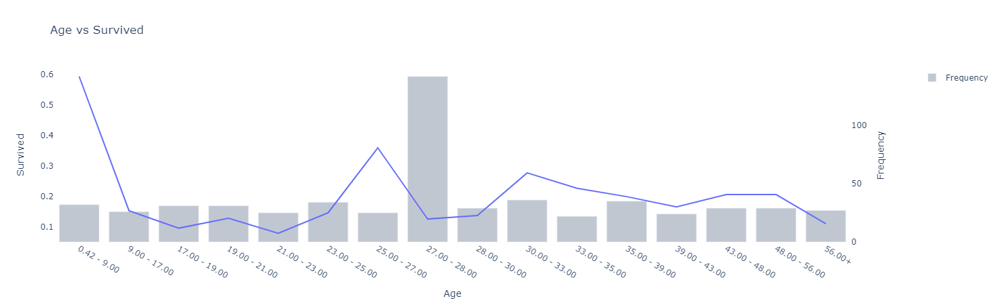
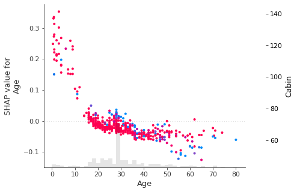

# FastExplain
> Fit Fast, Explain Fast

## Installing
```
pip install fast-explain
``` 
## About FastExplain
FastExplain provides an **out-of-the-box** methodology for users to **quickly explore data**, with **flexibility to fine-tune** if needed.
- **Automated fitting** of machine learning models with hyperparameter search
- **Aesthetic display** of explanatory methods ready for reporting
- **Connected interface** for all models and related explanatory methods

## Quickstart
### Automated Fitting
``` python
from FastExplain import model_data
from FastExplain.datasets import load_titanic_data
df = load_titanic_data()
classification = model_data(df, 'Survived')
``` 
### Aesthetic Display
``` python
from FastExplain.explain import plot_one_way_analysis, plot_ale
```
``` python
plot_one_way_analysis(classification.data.df, "Age", "Survived", filter = "Sex == 1")
```


``` python
plot_ale(classification.m, classification.data.xs, "Age", filter = "Sex == 1")
```


### Connected Interface
``` python
classification.plot_one_way_analysis("Age", filter = "Sex == 1")
classification.plot_ale("Age", filter = "Sex == 1")
```

``` python
classification.shap_dependence_plot("Age", filter = "Sex == 1")
```


``` python
classification.error
# {'auc': {'model': {'train': 0.9757607616377548,
# 'val': 0.8396574440052701,
# 'overall': 0.9512830345444667}},
# 'cross_entropy': {'model': {'train': 0.25061474553248525,
# 'val': 0.4548542718401812,
# 'overall': 0.29164603084009194}}}
``` 

## Models Supported
- Random Forest
- XGBoost
- Explainable Boosting Machine

## Exploratory Methods Supported:
- One-way Analysis
- Two-way Analysis
- Feature Importance Plots
- ALE Plots
- Explainable Boosting Methods
- SHAP Values
- Partial Dependence Plots
- Sensitivity Analysis


