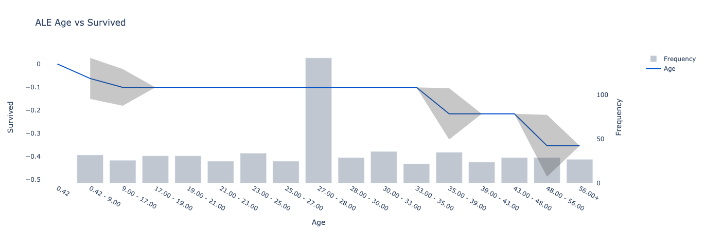
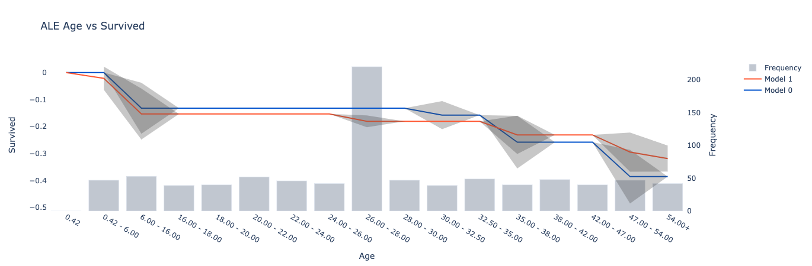

# FastExplain
> Fit Fast, Explain Fast

## Installing
```
pip install fast-explain
``` 
## Clean Data, Fit ML Models and Explore Results all in one line.
FastExplain provides an **out-of-the-box** tool for analysts to **quickly model and explore data**, with **flexibility to fine-tune** if needed.
- **Automated cleaning and fitting** of machine learning models with hyperparameter search
- **Aesthetic display** of explanatory methods ready for reporting
- **Connected interface** for all data, models and related explanatory methods

## Quickstart

[](https://colab.research.google.com/github/felixzhu17/FastExplain/blob/main/demos/FastExplain%20Titanic%20Quickstart.ipynb)

### Automated Cleaning and Fitting
``` python
from FastExplain import *
df = load_titanic_data()
classification = model_data(df, dep_var="Survived", model="ebm")
``` 
### Aesthetic Display
``` python
feature_correlation(classification.data.df)
```


``` python
plot_one_way_analysis(classification.data.df, "Age", "Survived", filter = "Sex == 1")
```


``` python
plot_ebm_explain(classification.m, classification.data.df, "Age")
```


``` python
plot_ale(classification.m, classification.data.xs, "Age", filter = "Sex == 1", dep_name = "Survived")
```


``` python
classification_1 = model_data(df, dep_var="Survived", model="rf", hypertune=True, cont_names=['Age'], cat_names = [])
models = [classification.m, classification_1.m]
data = [classification.data.xs, classification_1.data.xs]
plot_ale(models, data, 'Age', dep_name = "Survived")
```


### Connected Interface
``` python
classification_1.plot_one_way_analysis("Age", filter = "Sex == 1")
classification_1.plot_ale("Age", filter = "Sex == 1")
```

``` python
classification_1.shap_dependence_plot("Age", filter = "Sex == 1")
```


``` python
classification_1.error
# {'auc': {'model': {'train': 0.9934332941166654,
# 'val': 0.8421607378129118,
# 'overall': 0.9665739941840028}},
# 'cross_entropy': {'model': {'train': 0.19279692001978943,
# 'val': 0.4600233891109683,
# 'overall': 0.24648214781700722}}}
``` 

## Models Supported
- Random Forest
- XGBoost
- Explainable Boosting Machine
- ANY Model Class with *fit* and *predict* attributes

## Exploratory Methods Supported:
- One-way Analysis
- Two-way Analysis
- Feature Importance Plots
- ALE Plots
- Explainable Boosting Methods
- SHAP Values
- Partial Dependence Plots
- Sensitivity Analysis


